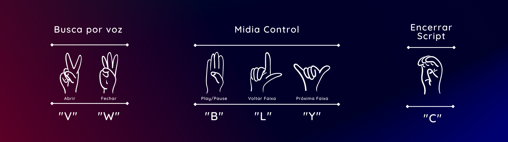

Este repositório contém um conjunto de códigos em Python para detectar e reconhecer gestos (triggers) realizados com as mãos a partir de imagens capturadas por uma câmera. 

Os triggers implementados até o momento são:
- Busca por voz utilizando o Google Chrome
- Controle de midia

## O que é necessário fazer para rodar esse programa no meu computador?
Para executar os códigos presentes neste repositório em seu próprio computador, você precisará cumprir as seguintes etapas:

1. Certifique-se de ter o [Python 3.x](https://www.python.org/downloads/) instalado no seu computador.

2. Faça o download ou clone o repositório do GitHub para o seu computador.

3. Abra um terminal e navegue até a pasta raiz do projeto.

4. Crie um ambiente virtual para isolar as dependências do projeto usando o comando 
```
python -m venv env
```
5. Ative o ambiente virtual com o comando:
- **Windows**
    ```
    .\env\Scripts\activate
    ```
- **Linux/MacOS**
    ```
    source env/bin/activate
    ```

6. Instale as dependências do projeto executando o comando
```
pip install -r requirements.txt
```

7. Execute o script principal com o comando 
```
python main.py
```

Lembre-se de que o programa requer uma câmera conectada ao computador para capturar os sinais de mão.

## Uso


## Contribuições
Contribuições são bem-vindas! Sinta-se à vontade para abrir um pull request ou reportar um problema através das issues.
